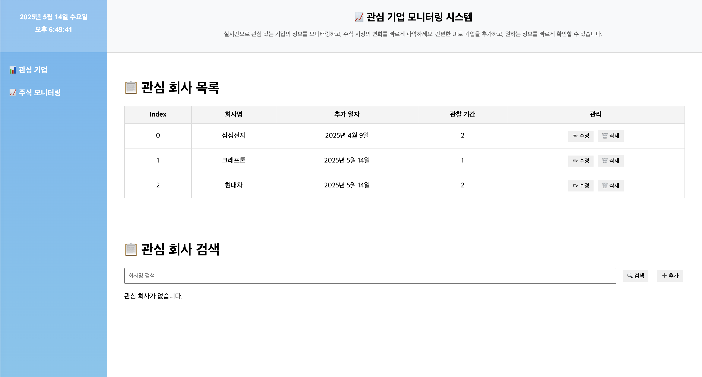
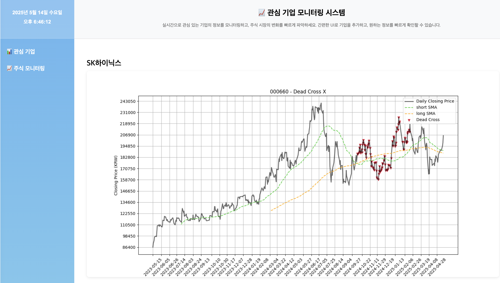

# stock_monitoring
_개인 주식 차트 확인용_<br>
실시간 목적이 아닌 중장기적 모니터링 목적으로 매일 그래프 생성

## setting

### frontend
```shell
npm install
npm run dev # 실행 명령어
```

### backend
**mysql 설치 필요**
1. pip install 후에 서버 실행 전 db 생성 및 초기 데이터 생성
- `stock_monitoring/backend/db/schemas.sql` 내 stock_db<br>
- `stock_monitoring/backend/db/seed.sql` 내 admin
```shell
pip install -r requirements.txt
uvicorn backend.main:app --reload # 실행 명령어
```


<br><br>

# 관심 기업 사이드바

## 관심 회사 검색 및 추가
1. 관심 기업 클릭
2. 관심 회사 검색, 포함된 단어로 검색
3. 체크 박스 체크 후 추가시 관심 회사 목록에 추가

## 관심 회사 관찰 기간 변경 및 삭제
1. 관심 회사 목록에서 관찰 기간(그래프 도출 기간) 설정 및 삭제 가능


<br><br><br><br><br><br>


# 주식 모니터링

현재는 기간에 따라 1년(short-30, long-50), 2년(short-50, long-200)으로 Dead Cross 그래프 표시
- 그래프 제목은 krx 기준 "회사 코드 - Dead Cross 여부"
